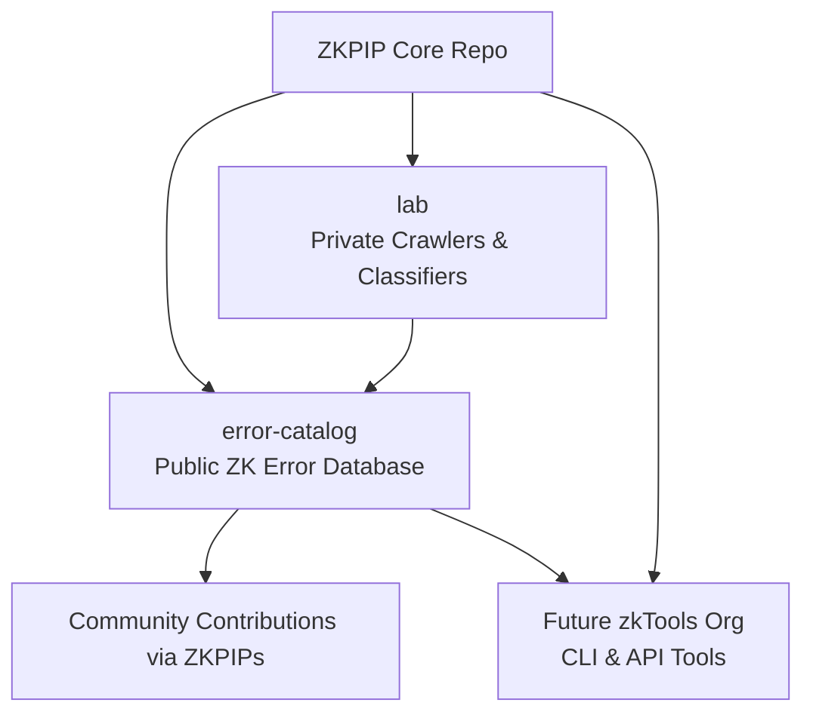

# ZKPIP – Zero-Knowledge Proof Improvement Proposals

This repository defines the **core framework, schemas, and governance model** for ZKPIP –  
a structured proposal system designed to standardize and unify the fragmented zero-knowledge (ZK) ecosystem.

---

## Purpose

ZKPIP exists to:

- Establish a **shared vocabulary** and **modular classification** system for ZK proofs, error types, tooling, and ecosystems.
- Serve as the **canonical reference** for ZK improvement proposals (ZKPIPs), enabling consistent formats and validation across all downstream projects.
- Support **open governance**, allowing contributors to propose, discuss, and evolve standards for the ZK community.

---

## Repository Role within the ZKPIP Organization

This repository represents the **ZKPIP core**.  
It contains:

- **Schemas** for ZKPIP documents, ecosystems, and standardized error definitions.
- **Governance documentation** under the `/ZKPIPs/` directory (`ZKPIP-XXXX.md` format).
- **Validation workflows** to ensure all proposals and datasets conform to the specification.

It works in coordination with other repositories in the ZKPIP organization:

- [`zkpip/error-catalog`](https://github.com/zkpip/error-catalog) – Public catalog of standardized ZK errors, maintained through ZKPIP governance.
- [`zkpip/lab`](https://github.com/zkpip/lab) – Private internal testbed for crawling, classifying, and validating ZK-related issues and datasets.

---

## Organization Structure



# Schema Validation Script

The project includes a schema validation script at:

```
scripts/validateSchemas.ts
```

### Purpose
This script ensures that all **JSON Schema definitions** and **data/test vectors** in the repository remain valid and consistent. It is designed to be run locally or in CI pipelines to catch schema or data structure regressions early.

### How it works
1. **Loads Core Schemas**  
   The script loads the 4 main JSON Schemas in a fixed order:
   - `mvs.core.schema.json`
   - `mvs.ecosystem.schema.json`
   - `mvs.issue.schema.json`
   - `mvs.verification.schema.json`

   Each schema is registered in AJV with its canonical `$id`.

2. **Validates Test Vectors**  
   All JSON files under:
   ```
   schemas/tests/vectors/mvs/
   ```
   are validated against the appropriate schema, detected from the filename prefix (`ecosystem-`, `issue-`, `verification-`).

3. **Validates Ecosystem Data**  
   All JSON files under:
   ```
   ecosystems/
   ```
   are recursively validated against `mvs.ecosystem.schema.json`, **excluding** the `ecosystems/extensions/` directory (extensions are a different data type and will have their own schema in the future).

4. **Strict Failure Mode**  
   - If a file is invalid, the script prints the validation errors and exits with a non-zero status code.  
   - This makes it suitable for CI usage, where schema compliance is required for all commits.

### Usage
From the project root:

```bash
npx ts-node --project ./tsconfig.scripts.json ./scripts/validateSchemas.ts
```

If you prefer, add it as an NPM script in `package.json`:

```json
"scripts": {
  "validate-schemas": "ts-node --project ./tsconfig.scripts.json ./scripts/validateSchemas.ts"
}
```

Then run:

```bash
npm run validate-schemas
```    
